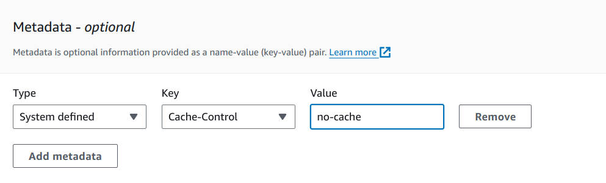

# Web editor

## Table of Contents

- [Web editor](#web-editor)
  - [Table of Contents](#table-of-contents)
  - [About](#about)
  - [Contributing](#contributing)
  - [Configure your IDE plugins](#configure-your-ide-plugins)
  - [Editor JS setup](#editor-js-setup)
    - [Supported blocks](#supported-blocks)
    - [Supported features](#supported-features)
    - [Block data](#block-data)
      - [Paragraph data](#paragraph-data)
      - [Header data](#header-data)
      - [List data](#list-data)
      - [Table data](#table-data)
      - [Delimiter data](#delimiter-data)
  - [How to deploy](#how-to-deploy)
    - [Using GitHub Actions](#using-github-actions)
    - [Manually](#manually)

## About

Web editor is a Notion-like SPA. It is a block-based text editor which is fine-tuned for the authors.

Before executing npm commands set your Node to `lts/hydrogen`, or `v18.16.1`.

- `nvm use lts/hydrogen` - set Node version that we use
- `npm start` - start dev server
- `npm run build` - build optimized version

## Contributing

Please read [Code of conduct](./code-of-conduct.md) before contributing.

## Configure your IDE plugins

In the project, we use the **_Prettier - Code formatter_** plugin in VS Code ([VS Code Marketplace](https://marketplace.visualstudio.com/items?itemName=esbenp.prettier-vscode")), which implements automatic formatting code with our rules in the **.prettierrc** and according to the automatic sorting of the Tailwind classes using Prettier.
You also need to set Prettier as the default formatter in VS Code and confirm format on save.

## Editor JS setup

We use [EditorJs](https://editorjs.io/) as our main driver for text editing. It has rich collection of plugins, and nice adaptive UI is built-in. However it also has some limitations, namely, the lack of built-in realtime collaboration, flat structure only (children blocks are almost impossible to make and maintain).

Every plugin has it's own defined data structure. So I will list all plugins that we use and document the data structure they provide for clarity.

### Supported blocks

| **Block name**   | **GitHub link**                                                                            | **Will be in Gvary** | **Ready to use** |
|------------------|--------------------------------------------------------------------------------------------|----------------------|------------------|
| Paragraph        | [@editorjs/paragraph](https://github.com/editor-js/paragraph)                              |                1.0.0 |         ✅        |
| Header           | [@editorjs/header ](https://github.com/editor-js/header)                                   |                1.0.0 |         ✅        |
| List             | [@editorjs/nested-list](https://github.com/editor-js/nested-list)                          |                1.0.0 |         ✅        |
| Table            | [@editorjs/table](https://github.com/editor-js/table)                                      |                1.0.0 |         ✅        |
| Delimiter        | [@editorjs/delimiter](https://github.com/editor-js/delimiter)                              |                1.0.0 |         ✅        |
| Quote            | [@editorjs/quote](https://github.com/editor-js/quote)                                      |                1.1.0 |         ❌        |
| Image            | [@editorjs/image](https://github.com/editor-js/image)                                      |                1.2.0 |         ❌        |
| Attachments      | [@editorjs/attaches](https://github.com/editor-js/attaches)                                |                    ? |         ❌        |
| Panel            | doesn't exist                                                                              |                    ? |         ❌        |

### Supported features

| **Feature name** | **GitHub link**                                                                                      | **Will be in Gvary** | **Ready to use** |
|------------------|------------------------------------------------------------------------------------------------------|----------------------|------------------|
| Bold             | built-in                                                                                             |                1.0.0 |         ✅       |
| Italic           | built-in                                                                                             |                1.0.0 |         ✅       |
| Strikethrough    | [@sotaproject/strikethrough](https://www.npmjs.com/package/@sotaproject/strikethrough)               |                1.0.0 |         ✅       |
| Underline        | [@editorjs/underline](https://github.com/editor-js/underline)                                        |                1.0.0 |         ✅       |
| Undo/Redo        | [editorjs-undo](https://github.com/kommitters/editorjs-undo)                                         |                1.0.0 |         ✅       |
| Drag&Drop        | [editorjs-drag-drop](https://github.com/kommitters/editorjs-drag-drop)                               |                1.0.0 |         ✅       |
| Alignment        | [editorjs-text-alignment-blocktune](https://www.npmjs.com/package/editorjs-text-alignment-blocktune) |                1.1.0 |         ❌       |
| Change case      | [editorjs-change-case](https://github.com/maziyank/editorjs-change-case)                             |                    ? |         ✅       |
| Spoiler          | [editorjs-inline-spoiler-tool](https://www.npmjs.com/package/editorjs-inline-spoiler-tool)           |                    ? |         ❌       |
| Indentation      | [editorjs-indent-tune](https://www.npmjs.com/package/editorjs-indent-tune)                           |                    ? |         ✅       |
| Text color       | [editorjs-text-color-plugin](https://www.npmjs.com/package/editorjs-text-color-plugin)               |                    ? |         ❌       |
| Text background  | doesn't exist                                                                                        |                    ? |         ❌       |

### Block data

This section defines data example and JSON schema for every block.

EditorJS uses [nanoid](https://www.npmjs.com/package/nanoid) for generating unique IDs for blocks. To be more specific, [it generates IDs of 10 characters long](https://github.com/codex-team/editor.js/blob/next/src/components/utils.ts#L662).

10 characters give us [152M IDs](https://zelark.github.io/nano-id-cc/). 

Also each block will have user ID and chapter ID in addition to block ID, thus it is impossible for 1 user to use 152M IDs in 1 chapter.

Some block ID examples: `YTdVxlokok`, `hGpacP0GHt`, `tzTjDCRab9`.

#### Paragraph data

```json
{
  "text": "This is text! <b>HTML tags are possible</b>.",
  "alignment": "left"
}
```

#### Header data

```json
{
  "text": "Is this a header&gt;?",
  "level": 2,
  "alignment": "right"
}
```

#### List data

```json
{
  "style": "ordered",
  "items": [
    {
      "content": "just a text",
      "items": []
    },
    {
      "content": "can be nested",
      "items": [
        {
          "content": "i am nested",
          "items": []
        }
      ]
    }
  ]
}
```

#### Table data

```json
{
  "withHeadings": true,
  "content" [
    ["Text", "Col2"],
    ["row2", "row2Col2"]
  ]
}
```

#### Delimiter data

```json
{}
```

## How to deploy

### Using GitHub Actions

1. Go to [Actions - Deploy workflow](https://github.com/gvary-ua/web-editor/actions/workflows/deploy.yaml)
2. Press `Run workflow`
3. Select your branch and env to deploy
4. Press green `Run workflow`
5. Done!

### Manually

We use [cache-busting strategy](https://developer.mozilla.org/en-US/docs/Web/HTTP/Headers/Cache-Control#caching_static_assets_with_cache_busting) for our assets.

1. Clear `build/` folder
2. Build project with `npm run build`
3. Login to AWS SSO page and go to `dev` account
4. Find `editor.dev.gvary.com` bucket in S3
5. Upload `index.html` with `Cache-Control` set to `no-cache`



6. Upload rest of the files with `Cache-Control` set to `max-age=31536000, immutable`

Done!

If your page didn't update do the following:

7. Find `editor.dev.gvary.com` distribution in CloudFront
8. Go to `Invalidations` tab
9. Press `Create Invalidation`
10. Input `/index.html`
11. Wait till status is `Completed`

Done!